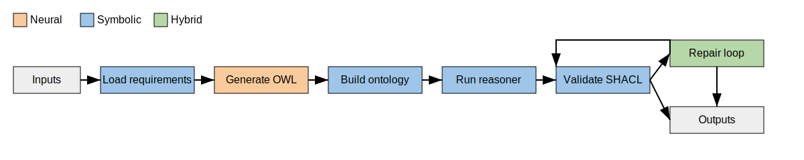
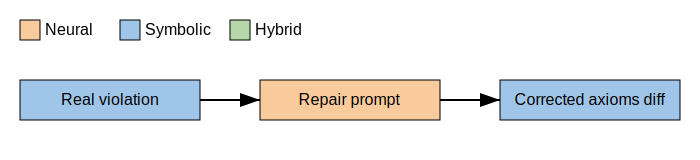
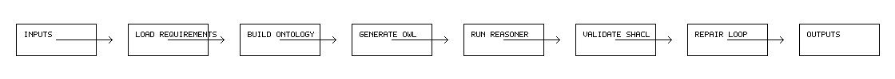

# 🧠 Σύνταξη Οντολογιών από Απαιτήσεις Λογισμικού

Το αποθετήριο αυτό υλοποιεί μια μικτή **νευρο-συμβολική** διαδικασία που μετατρέπει φυσικές γλώσσες απαιτήσεων σε οντολογίες OWL.  
Ο συνδυασμός της υπολογιστικής ισχύος μεγάλων γλωσσικών μοντέλων (LLMs) με κανόνες SHACL επιτρέπει την αυτόματη δημιουργία, επικύρωση και διόρθωση τριπλετών.

Demo Url: https://kristitsami.pythonanywhere.com/

> Αναπτύχθηκε στο πλαίσιο μεταπτυχιακής διπλωματικής εργασίας στην Τεχνητή Νοημοσύνη.

---

## 📂 Δομή Αρχείων

```
Ontology-Guided/
├── ontology_guided/         # Python package με τον βασικό κώδικα
│   ├── __init__.py
│   ├── data_loader.py       # Φόρτωση και προεπεξεργασία κειμένων
│   ├── llm_interface.py     # Επικοινωνία με το LLM (π.χ. GPT-4)
│   ├── ontology_builder.py  # Ενοποίηση Turtle σε αρχείο OWL/TTL
│   ├── repair_loop.py       # Επαναληπτική επιδιόρθωση με LLM
│   └── validator.py         # SHACL έλεγχος ορθότητας
├── scripts/                 # Εκτελέσιμα βοηθητικά scripts
│   ├── main.py              # Ενοποιημένο pipeline
│   ├── generate_examples.py # Δημιουργία παραδειγμάτων
│   └── web_app.py           # Απλή web διεπαφή
├── tests/                   # Μονάδες ελέγχου
├── demo.txt                 # Δείγμα απαιτήσεων
├── shapes.ttl               # Κανόνες SHACL
├── requirements.txt         # Εξαρτήσεις Python
└── README.md
```

---
## 🔄 OG‑NSD Pipeline



## ♻️ Repair Loop

The diagram below zooms into the repair cycle from detecting a real violation to producing the corrected axioms diff.



### Termination & Guarantees

Ο βρόχος διακόπτεται είτε όταν επιτευχθούν `kmax` επαναλήψεις είτε μόλις η SHACL επικύρωση ολοκληρωθεί χωρίς παραβιάσεις.
Η τιμή `conforms=True` σηματοδοτεί πλήρη συμμόρφωση με τους κανόνες SHACL· εφόσον η επιλογή `reason` είναι ενεργή, διασφαλίζεται επιπλέον συνεκτικότητα μέσω λογικού συμπερασμού.
Η προτροπή ζητά ελάχιστες διορθώσεις και το σύστημα υπολογίζει το diff μεταξύ των αρχικών και των διορθωμένων τριπλετών για να μετρήσει την επίδραση κάθε επανάληψης.

---
## 🗺️ Διάγραμμα Ροής Δεδομένων



Για να αναγεννήσετε το διάγραμμα μετά από αλλαγές στο pipeline εκτελέστε:

```bash
python3 scripts/generate_dfd.py
```


## 🚀 Γρήγορη Εκκίνηση

1. **Εγκατάσταση βιβλιοθηκών**
   ```bash
   python3 -m pip install -r requirements.txt
   python3 -m spacy download en_core_web_sm
   ```

2. **Ρύθμιση κλειδιού API**
   Δημιουργήστε αρχείο `.env` με την μεταβλητή `OPENAI_API_KEY` για να μπορεί το LLM να κληθεί.

3. **Εκτέλεση ενοποιημένου pipeline**
   ```bash
   python3 scripts/main.py --inputs demo.txt --shapes shapes.ttl --reason --repair
   ```
   Το script διαβάζει τις απαιτήσεις, παράγει τα OWL triples, τρέχει τον
   reasoner και τον έλεγχο SHACL, και αν χρειαστεί εκτελεί αυτόματο βρόχο διόρθωσης.
   Ο φάκελος `results/` δημιουργείται αυτόματα αν δεν υπάρχει.

   Προαιρετικές επιλογές:
   - `--base-iri`: αλλάζει το βασικό IRI της παραγόμενης οντολογίας.
   - `--ontologies`: λίστα από επιπλέον αρχεία TTL που θα φορτωθούν.
   - `--ontology-dir`: φόρτωση όλων των οντολογιών από φάκελο.
   - `--rbo`, `--lexical`: συμπερίληψη των προ-ενσωματωμένων οντολογιών.
   - `--spacy-model`: ορίζει ποιο spaCy μοντέλο θα χρησιμοποιηθεί για τμηματοποίηση προτάσεων.
   - `--inference`: επιλέγει τρόπο συμπερασμού κατά την επικύρωση SHACL (`none`, `rdfs`, `owlrl`).
   - `--model`: επιλέγει ποιο LLM θα κληθεί (προεπιλογή: `gpt-4`).
   - `--kmax`: μέγιστος αριθμός επαναλήψεων στον βρόχο διόρθωσης (προεπιλογή: `5`).
   - `--no-terms`: δεν παρέχονται διαθέσιμοι όροι της οντολογίας στο LLM (προεπιλογή: παρέχονται).
   - `--no-shacl`: απενεργοποίηση του ελέγχου SHACL και του βρόχου διόρθωσης (προεπιλογή: ενεργοποιημένα).

   Παράδειγμα με προσαρμοσμένες επιλογές:
   ```bash
   python3 scripts/main.py --inputs demo.txt --shapes shapes.ttl --ontology-dir ontologies --rbo --lexical --base-iri http://example.com/atm#
   ```

   Η προαιρετική σημαία `--reason` τρέχει τον ενσωματωμένο reasoner της OWLready2 πριν τον έλεγχο SHACL.
   Για να λειτουργήσει, απαιτείται εγκατεστημένο Java (π.χ. OpenJDK).

4. **Αυτόματη δημιουργία παραδειγμάτων**
   ```bash
   python3 scripts/generate_examples.py
   ```
   Παράγει τα αρχεία `results/combined.ttl` και `results/combined.owl` από το `demo.txt`.
5. **Χειροκίνητη εκτέλεση επιμέρους βημάτων** (προαιρετικά)
   ```bash
   python3 ontology_guided/ontology_builder.py    # συγχώνευση σε combined.ttl/owl
   python3 ontology_guided/validator.py --data results/combined.ttl --shapes shapes.ttl
   python3 ontology_guided/repair_loop.py         # εφόσον υπάρχουν παραβιάσεις
   ```
6. **Εκτέλεση tests**
   ```bash
   pytest
   ```
   Τα tests βρίσκονται στον φάκελο `tests/` και τρέχουν χωρίς πραγματική κλήση στο OpenAI API.

7. **Εκκίνηση Web διεπαφής**
   ```bash
   python3 scripts/web_app.py
   ```
   Ανοίξτε τον browser στη διεύθυνση `http://localhost:8000` για να ανεβάσετε κείμενο, αρχεία απαιτήσεων, πολλαπλά αρχεία οντολογιών, προσαρμοσμένο base IRI και (προαιρετικά) αρχείο κανόνων SHACL.

   Στη φόρμα υπάρχουν επίσης τα checkboxes:
   - **Repair**: ενεργοποιεί τον αυτόματο βρόχο διόρθωσης παραβιάσεων SHACL.
   - **Reason**: τρέχει τον reasoner της OWLready2 πριν τον έλεγχο SHACL.

   Μετά την εκτέλεση εμφανίζονται οι προ-επεξεργασμένες προτάσεις, τα αποσπάσματα OWL που παράγονται από το LLM, η έξοδος του reasoner και η αναφορά SHACL (συμμόρφωση και λεπτομέρειες), μαζί με την τελική οντολογία.

   Τα αρχεία που ανεβάζονται διαγράφονται αυτόματα μετά την ολοκλήρωση κάθε αιτήματος.

---

## 📦 Προ-ενσωματωμένες Οντολογίες

- **ontologies/rbo.ttl**: ορίζει βασικές κλάσεις για Requirements, Actions και Actors, μαζί με τις ιδιότητες `requiresAction` και `performedBy`.
- **ontologies/lexical.ttl**: περιέχει λεξική δομή με κλάσεις `Word`, `Noun` και σχέσεις `synonym`, `antonym` μεταξύ λέξεων.

## 🏥 Εναλλαγή Τομέων

Η ίδια διαδικασία μπορεί να στραφεί σε διαφορετικό domain αλλάζοντας απλώς
τις απαιτήσεις, τα SHACL shapes και τις (προαιρετικές) οντολογίες. Για
παράδειγμα, το παρακάτω command εκτελεί το pipeline σε σενάριο υγείας χωρίς
καμία επανεκπαίδευση του μοντέλου:

```bash
python3 scripts/main.py \
    --inputs evaluation/healthcare_requirements.txt \
    --shapes evaluation/healthcare_shapes.ttl \
    --ontologies ontologies/healthcare.ttl \
    --base-iri http://example.com/healthcare#
```

Το αποτέλεσμα είναι μια οντολογία με κανόνες για γιατρούς, ασθενείς και
ιατρικές παρατηρήσεις.

## 📊 Αξιολόγηση

Για να συγκρίνετε τα παραγόμενα OWL triples με ένα χρυσό πρότυπο, χρησιμοποιήστε το script:

```bash
python3 evaluation/compare_metrics.py evaluation/atm_requirements.txt evaluation/atm_gold.ttl
```

Το script υπολογίζει **precision** και **recall** και αποθηκεύει τις μετρικές στο `results/metrics.txt`.

## 🔧 Εργαλεία
- **spaCy** για τμηματοποίηση προτάσεων
- **OpenAI API** για παραγωγή αρχικών τριπλετών
- **rdflib** και **OWLready2** για χειρισμό οντολογιών
- **pySHACL** για επικύρωση με κανόνες SHACL

---

## 📝 Άδεια Χρήσης
Διανέμεται υπό την άδεια MIT.
