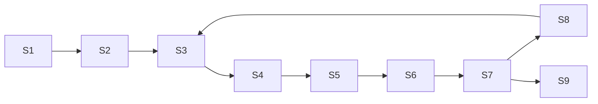

## 3.4.2 Διαγράμματα Ροής Δεδομένων (DFD)

Οι διαδικασίες **S1**–**S9** ορίζονται ως κόμβοι του DFD και μοντελοποιούν τη ροή του pipeline:

* **S1** – Συλλογή ακατέργαστων απαιτήσεων.
* **S2** – Προεπεξεργασία και καθαρισμός κειμένου.
* **S3** – Κατασκευή αρχικής οντολογίας.
* **S4** – Παραγωγή τριπλετών OWL.
* **S5** – Λογικός συμπερασμός πάνω στην οντολογία.
* **S6** – Έλεγχος κανόνων SHACL.
* **S7** – Συγκέντρωση επικυρωμένων αποτελεσμάτων.
* **S8** – Βρόχος διόρθωσης με LLM.
* **S9** – Παράδοση τελικής οντολογίας στον χρήστη.

Η κύρια ροή δεδομένων εξελίσσεται διαδοχικά **S1→S2→S3→S4→S5→S6→S7→S8**.
Η διαδικασία **S7** εξάγει τα επικυρωμένα δεδομένα προς την τελική έξοδο **S9** (**S7→S9**).
Η **S8** επιστρέφει διορθώσεις στην **S3**, δημιουργώντας βρόχο ανατροφοδότησης (**S8→S3**) που επιτρέπει επαναληπτική βελτίωση.

### Διάγραμμα DFD (Level 0)

### Ανάλυση

Το παραπάνω DFD αποτυπώνει την κυκλική επεξεργασία του pipeline.
Η γραμμική ακολουθία **S1–S8** επιτρέπει τον σταδιακό μετασχηματισμό των απαιτήσεων σε οντολογία.
Ο βρόχος **S8→S3** επαναεισάγει διορθώσεις στο στάδιο κατασκευής οντολογίας, διασφαλίζοντας συνεχή ανατροφοδότηση και βελτίωση.
Η ροή **S7→S9** ξεχωρίζει την τελική εξαγωγή αποτελέσματος, δίνοντας σαφή οριοθέτηση μεταξύ επεξεργασίας και παράδοσης.
Το σχήμα αυτό αναδεικνύει πώς η επανάληψη και η επικύρωση συνδυάζονται ώστε να παράγεται αξιόπιστη τελική οντολογία.

